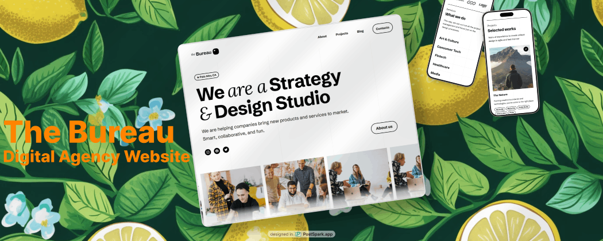

‼ This project is for showcase purpose only for the full project please contact ‼

<div align="center">
  <br />
      
  <br />
  <div>
     <br />

  
  
  
  
  
  
  
  
  
  
  </div>

  <h3 align="center">Modern UI/UX Digital Agency website</h3>

   <div align="center">
     The Bureau is a minimalistic template for agencies, studios and it’s also perfect for freelance designers. The template style contains only white and black colors which looks very minimalistic and sharp. This template is made with using all the newest ReactJS features and free-to-use elements like free fonts and icons.
    </div>
</div>

## 📋 <a name="table">Table of Contents</a>

1. 🤖 [Introduction](#introduction)
2. ⚙️ [Tech Stack](#tech-stack)
3. 🔋 [Features](#features)
4. 🤸 [Quick Start](#quick-start)
5. 🕸️ [Snippets](#snippets)
6. 🔗 [Links](#links)
7. 🚀 [More](#more)
8. ⚠️ [Disclaimer](#disclaimer)

## <a name="tech-stack">⚙️ Tech Stack</a>

- Vite
- React.js
- Tailwind CSS
- Framer Motion
- Typescript
- React router dom
- react query ( tanstack )
- zustand
- Vitest
- Docker
- CI / CD

## <a name="features">🔋 Features</a>

👉 **Beautiful Sections**: Includes hero, services, features, blog, career, footer, header and other pages.

👉 **Framer Motion Animations**: Engaging effects triggered by mouse movement and scrolling

👉 **Lenis Scroll**: Smooth Scroll effects triggered by mouse movement

👉 **Complex UI Accordion and more**: Utilizes tailwindcss for displays, grid lines, testimonials, accordions.

👉 **Latest UI Trends**: Incorporates modern design elements such as bento grids.

👉 **Cool Gradients**: Enhances visuals with stylish gradients using Tailwind CSS for cards, buttons, etc.

👉 **Responsive**: Ensures seamless functionality and aesthetics across all devices

and many more, including code architecture and reusability

## <a name="quick-start">🤸 Quick Start</a>

Follow these steps to set up the project locally on your machine.

**Prerequisites**

Make sure you have the following installed on your machine:

- [Git](https://git-scm.com/)
- [Node.js](https://nodejs.org/en)
- [pnpm](<(https://pnpm.io/)>) (PNode Package Manager)

**Cloning the Repository**

```bash
git clone https://github.com/km64/thebureau-c.git
cd theBureau
```

**Installation**

Install the project dependencies using npm:

```bash
pnpm install
```

**Running the Project**

```bash
pnpm run dev
```

Open [http://localhost:8080](http://localhost:8080) in your browser to view the project.

## <a name="links">🔗 Links</a>

- [Design](https://www.figma.com/design/qTHuhErF1stfS6EgtzAN39/Untitled?node-id=0-1&t=AHUjD5eolg3KOPQK-1)
- [Live Website](https://bureau-desk-91.netlify.app/?ref=bureau-sc)

## <a name="more">🚀 More</a>

Feel free to reach out via email or phone — I’m always happy to connect!

<div style="display: flex; flex-wrap: wrap; gap: 8px; margin-top: 8px;">
  <!-- Email badge -->
  <a href="kevinmijnhijmer@gmail.com">
    
  </a>
  <!-- Mobile badge -->
  <a href="tel:+31687116135">
    
  </a>
  <a href="https://www.mijnh.live?ref=bureau-sc">
    
  </a>
</div>

## <a name="disclaimer">⚠️ Disclaimer</a>

<div style="margin-top: 8px; font-size: 0.85rem; color: #666;">
  ⚠️ I do not claim the design or the Framer template as my copyright or any other legal right. This project is replicated solely to showcase my skills to future employers. ⚠️ 
</div>
